# Console Z
### Z-Image Workflow v2.0
> *The Ultimate Z-Image Upscale & Restoration Workflow for ComfyUI*

## Download
- [Download Workflow (JSON)](workflows/console-z-workflow-v2-0.json)
- [Download Workflow (PNG)](workflows/console-z-workflow-v2-0.png)
- [Download Workflow with Demo (PNG)](workflows/console-z-workflow-v2-0-demo.png)

## Overview
Console Z is a high-performance, streamlined ComfyUI workflow designed for quick image upscaling and restoration. It combines the speed of **Z-Image Turbo** with the state-of-the-art **SeedVR2** and **Ultimate SD Upscale** technologies.

## Architecture Data Flow

```mermaid
graph TD
    classDef core fill:#223355,stroke:#66ccff,stroke-width:2px,color:#fff;
    classDef input fill:#332233,stroke:#ff99cc,stroke-width:2px,color:#fff;
    classDef sampler fill:#224433,stroke:#44ff99,stroke-width:2px,color:#fff;
    classDef decision fill:#553322,stroke:#ffcc66,stroke-width:2px,color:#fff;
    classDef upscale fill:#2a363b,stroke:#99aabb,stroke-width:2px,color:#fff;
    classDef final fill:#333344,stroke:#aa88ff,stroke-width:2px,color:#fff;

    Core["⚡ Core Engine<br/>Load Models / LoRA<br/>(Patch Sage Attn)"]:::core
    Input{"🔄 Input Switch"}:::input
    T2I["Text-to-Image"]:::input
    I2I["Image-to-Image"]:::input
    Samp1["🎨 Sampler 1<br/>Base Generation"]:::sampler
    MethodSwitch{"🔀 Upscale Decision"}:::decision
    M1["Method 1: Latent Upscale<br/>(Speed)"]:::upscale
    M2["Method 2: Pixel Upscale<br/>(Quality)"]:::upscale
    Samp2["🖌️ Sampler 2<br/>Refinement"]:::sampler
    RestoreEntry{"💫 Restoration Modules Decision<br/>(Upscale + Restore)"}:::decision
    UltSD["Ultimate SD Upscale"]:::final
    SeedVR["SeedVR2"]:::final
    FinishingEntry{"✨ Finishing Modules Decision"}:::decision
    Sharpen["🔪 Lucy Sharpen"]:::final
    Grain["🎞️ Film Grain"]:::final
    Output((Save Image)):::final

    Core --> T2I
    Core --> I2I
    T2I --> Input
    I2I --> Input
    Input --> Samp1
    Samp1 --> MethodSwitch
    
    MethodSwitch -- "Method 1" --> M1
    MethodSwitch -- "Method 2" --> M2
    
    MethodSwitch -- "Bypass Sampler 2" --> RestoreEntry
    
    M1 --> Samp2
    M2 --> Samp2
    Samp2 --> RestoreEntry
    
    RestoreEntry -- "Bypass Restoration" --> FinishingEntry
    RestoreEntry --> UltSD
    UltSD --> SeedVR
    SeedVR --> FinishingEntry
    
    FinishingEntry -- "Bypass Finishing" --> Output
    FinishingEntry --> Sharpen
    Sharpen --> Grain
    Grain --> Output

```

## Key Features

- **Turbocharged Core**: Integrated with `Patch Sage Attention KJ` and `Torch Compile Settings` (FP16 Accumulation) to maximize inference speed on supported hardware.

- **LoRA Ready**: Seamlessly integrated LoRA support. Simply connect your preferred LoRA models to the dedicated loader stack to instantly enhance style or character consistency without disrupting the core workflow.

- **Dual Upscale Methods**:
  - **Method 1 (Latent)**: Fast latent upscaling for rapid prototyping.
  - **Method 2 (Pixel)**: High-quality pixel upscaling with automatic resolution calculation.

- **SeedVR2 Integration**: Implements `SeedVR2 Video Upscaler` (v2.5) for advanced detail restoration and artifact reduction.

- **Smart Control**:  
  - **Auto-Resolution**: Automatically detects image orientation and calculates optimal upscale factors.
  - **Modular Bypassing**: Easily toggle Ultimate SD Upscale, SeedVR2, or Sharpening modules using `Fast Groups Bypasser`.

- **Cinematic Finish**: Includes `LTXV Film Grain` and `Lucy Sharpen` for that final professional polish.

## Requirements
Ensure you have the following Custom Node packs installed via ComfyUI Manager:

- ComfyUI-SeedVR2_VideoUpscaler
- ComfyUI-KJNodes
- rgthree-comfy
- ComfyUI_UltimateSDUpscale
- ComfyUI-LTXVideo
- Was Node Suite
- ComfyUI_JPS-Nodes
- ComfyUI-Easy-Use
- ComfyUI_FearnworksNodes

## Usage Guide

### Load Models & LoRAs
Select your Checkpoint in the **Load Models** group. Connect your LoRAs in the **LoRA Stack** group to apply custom styles.

### Select Input Mode
- **Text-to-Image**: Enter your prompt and leave the Load Image node bypassed or unused.
- **Image-to-Image**: Load your image in the **Load Image (i2i)** group and ensure the switch is set to use the image input.

### Configure Sampler Upscaling
- **Use Sampler 2 Upscale?**: Choose whether to enable the second pass upscaling.
- **Sampler 2 Upscale Method**: Selects between 1: Latent Upscale (Faster) and 2: Pixel Upscale (Quality).

### Choose Additional Upscaling (as needed)
- **Ultimate SD Upscale**: Enable to enhance details and add texture density.
- **SeedVR2**: Enable for structural restoration and removing artifacts.
- **Control**: Use the Fast Bypasser buttons to toggle these modules on/off instantly.
- **⚠️ Important**: It is recommended to choose **EITHER** Ultimate SD Upscale **OR** SeedVR2, not both simultaneously. If you must chain them, significantly reduce the upscale factor (e.g., 1.2x or 1.5x) to prevent OOM errors and excessive image dimensions.

### Adjust Final Look
Tweak intensity in the **LTXV Film Grain** node or adjust iterations in the **Lucy Sharpen** node for your desired output. Use the Fast Bypasser buttons to toggle these modules on/off instantly.

> [!TIP]
> **Installation Fix**: If you encounter errors when installing `LTXV Film Grain` (e.g., Import Error), this GitHub discussion provides a working solution: [View Fix on GitHub #284](https://github.com/Lightricks/ComfyUI-LTXVideo/pull/284)

## Notes
- **VRAM Usage**: SeedVR2 can be VRAM intensive. If you encounter OOM errors, enable `Tiled VAE` in the SeedVR2 settings.
