# Console Z
### Z-Image Workflow v2.1
> *The Ultimate Z-Image Upscale & Restoration Workflow for ComfyUI*

## Download
- [Download Workflow (JSON)](workflows/Console-Z-Workflow-v2-1.json)
- [Download Workflow (PNG)](workflows/Console-Z-Workflow-v2-1.png)
- [Download Workflow with Demo (PNG)](workflows/Console-Z-Workflow-v2-1-demo.png)

## Overview
**Console Z** is a high-performance, modular ComfyUI workflow designed for **Z-Image Turbo**, focusing on precision image generation, upscaling, and restoration. It features a "Console-style" control center for managing complex pipelines effortlessly, allowing users to toggle specific processing stages without rewiring nodes.

## Architecture Data Flow

```mermaid
graph TD
    classDef core fill:#223355,stroke:#66ccff,stroke-width:2px,color:#fff;
    classDef input fill:#332233,stroke:#ff99cc,stroke-width:2px,color:#fff;
    classDef sampler fill:#224433,stroke:#44ff99,stroke-width:2px,color:#fff;
    classDef decision fill:#553322,stroke:#ffcc66,stroke-width:2px,color:#fff;
    classDef upscale fill:#2a363b,stroke:#99aabb,stroke-width:2px,color:#fff;
    classDef final fill:#333344,stroke:#aa88ff,stroke-width:2px,color:#fff;
    classDef processing fill:#442244,stroke:#ff77ff,stroke-width:2px,color:#fff;
    classDef fix fill:#663300,stroke:#ffcc99,stroke-width:2px,color:#fff;

    Core["⚡ Core Engine<br/>Load Models / LoRA<br/>(Patch Sage Attn)"]:::core
    Input{"🔄 Input Switch"}:::input
    T2I["Text-to-Image"]:::input
    I2I["Image-to-Image"]:::input
    Samp1["🎨 Sampler 1<br/>Base Generation"]:::sampler
    
    %% Sampler 2 Block
    Samp2Check{"Use Sampler 2?"}:::decision
    UpscaleDec{"🔀 Upscale Decision"}:::decision
    M1["Method 1:<br/>Pixel Upscale"]:::upscale
    M2["Method 2:<br/>Latent Upscale"]:::upscale
    Samp2["🖌️ Sampler 2<br/>Refinement"]:::sampler
    
    %% Decision Point for Post-Processing
    AddProcDec{"🛠️ Additional Processing Decision"}:::decision

    %% Additional Processing Chain
    subgraph  
        direction TB
        ColorMatch["🌈 Color Match<br/>(Optional)"]:::fix
        UltSD["📐 Ultimate SD Upscale<br/>(Optional)"]:::processing
        SeedVR["🎥 SeedVR2 Upscaler<br/>(Optional)"]:::processing
        Sharpen["🔪 Image Sharpen FS<br/>(Optional)"]:::final
        Grain["🎞️ LTXV Film Grain<br/>(Optional)"]:::final
    end
    
    Output((Save Image)):::final

    %% Connections
    Core --> T2I
    Core --> I2I
    T2I --> Input
    I2I --> Input
    Input --> Samp1
    
    Samp1 --> Samp2Check
    Samp2Check -- "Yes" --> UpscaleDec
    Samp2Check -- "No<br/>(Pass Samp 1 Image)" --> AddProcDec
    
    UpscaleDec --> M1
    UpscaleDec --> M2
    M1 --> Samp2
    M2 --> Samp2
    
    Samp2 --> AddProcDec
    
    %% Improved Labels here:
    AddProcDec -- "Additional Processing Chain<br/>(Individual Toggles)" --> ColorMatch
    AddProcDec -- "Skip to Save" --> Output
    
    %% Linear Chain Connections
    ColorMatch --> UltSD
    UltSD --> SeedVR
    SeedVR --> Sharpen
    Sharpen --> Grain
    Grain --> Output

```

## What's New in v2.1

- **Modular Stage Groups**: Distinct processing stages (Model, LoRA, Prompts, Samplers, Color Match, Additional Processing) are grouped closely with explicit toggles, minimizing canvas panning and allowing for easy layout customization.

- **Stage Previews**: Dedicated preview nodes for Sampler 1 and Sampler 2 with optional saving capabilities.

- **Color Match Module**: Restores color density and saturation lost during high-denoise ( > 0.5) sampling passes.

- **Better Sharpening**: Replaced standard sharpening with `Image Sharpen FS` (RES4LYF) for artifact-free detail enhancement.

## Key Features

- **Turbocharged Core**: Integrated with `Patch Sage Attention KJ` and `Torch Compile Settings` (FP16 Accumulation) to maximize inference speed on supported hardware.

- **Seamless I2I Integration**:
  - Switch between Text-to-Image (T2I) and Image-to-Image (I2I) instantly via Input Selection.
  - No need to rewire latent connections; simply load your image and toggle the "Image to Image?" switch. The workflow handles the VAE encoding and latent injection automatically.

- **LoRA Ready**: Seamlessly integrated LoRA support. Simply connect your preferred LoRA models to the dedicated loader stack to instantly enhance style or character consistency without disrupting the core workflow.

- **Dual Upscale Methods (Sampler 2)**:
  - **Method 1 (Pixel)**: High-quality pixel upscaling with automatic resolution calculation.
  - **Method 2 (Latent)**: Fast latent upscaling for rapid prototyping.

- **Smart Previews & Flexible Saving**:
  - Inspect results at both Sampler 1 and Sampler 2 stages.
  - Toggle `only_preview` to `False` on these nodes to save intermediate steps to disk, or keep `True` for temporary monitoring.

- **Smart Color Recovery**: `ColorMatch` node ensures color consistency between Sampler 1 and Sampler 2 outputs.

- **Additional Processing (Optional)**:
  - **Ultimate SD Upscale**: Adds texture to flat areas.
  - **SeedVR2**: Fixes artifacts and handles heavy restoration.

- **Cinematic Finish**: Includes `Image Sharpen FS` and `LTXV Film Grain` for a professional polish.

## Requirements
Ensure you have the following Custom Node packs installed via ComfyUI Manager:

- **rgthree-comfy** (Essential for switches and bypassing)
- **ComfyUI-KJNodes** (Essential for Get/Set wireless nodes & ColorMatch)
- **ComfyUI-Resolution-4-Life (RES4LYF)** (Required for Image Sharpen FS)
- **ComfyUI_Comfyroll_CustomNodes** (Required for CR Latent Input Switch)
- **ComfyUI-SeedVR2_VideoUpscaler**
- **ComfyUI_UltimateSDUpscale**
- **ComfyUI-LTXVideo**
- **Was Node Suite**
- **ComfyUI_JPS-Nodes**
- **ComfyUI-Easy-Use** (Required for easy imageSave / Preview)
## Usage Guide

### 1. Load Models & LoRAs
Select your Checkpoint in the **Load Models** group. Connect your LoRAs in the **Load LoRA** group to apply custom styles.
### 2. Input Mode (T2I / I2I)
- **Text-to-Image**: Enter your prompt. Ensure the **"Image to Image?"** switch is set to the OFF/Bypass position. 
- **Image-to-Image**:
    1. Load your source image in the **Load Image (i2i)** node.
    2. Toggle the **"Image to Image?"** switch to ON (Active).
    3. Adjust your denoise strength in Sampler 1 to control how much the input image is preserved.

### 3. Core Sampling & Monitoring
- **Use Sampler 2 Upscale?**: Toggle this to enable the second pass.
- **Preview vs. Save**: Check the **Sampler 1 Preview** and **Sampler 2 Preview** nodes.
    - **Default**: Set to `only_preview: True` (View only, no disk save).  
    - **To Save**: Change to `only_preview: False` if you want to keep the intermediate images.

### 4. Color Recovery (Optional)
This module acts as a bridge between the core samplers and additional processing.
- **Color Match**: Default is **OFF**.
- **When to use**: Enable this if you notice color shifting, desaturation, or loss of contrast after high-denoise sampling (Sampler 2). It will restore the color palette from Sampler 1 before passing the image to final processing.

### 5. Additional Processing (Optional)
These modules are for enhancement, not core upscaling. Toggle them ON only when needed.
- **Ultimate SD Upscale**: Best for adding details to textures.
- **SeedVR2**: Best for restoration and fixing artifacts.
- **⚠️ Important**: Avoid enabling both simultaneously unless you have massive VRAM. If chaining, reduce upscale factors significantly.

### 6. Final Polish
- **Sharpening**: Now uses **Image Sharpen FS** for natural detail.
- **Film Grain**: Adjust intensity in the **LTXV Film Grain** node.

> [!TIP]
> **Installation Fix**: If you encounter errors when installing `LTXV Film Grain` (e.g., Import Error), this GitHub discussion provides a working solution: [View Fix on GitHub #284](https://github.com/Lightricks/ComfyUI-LTXVideo/pull/284)

## Notes
- **VRAM Usage**: SeedVR2 can be VRAM intensive. If you encounter OOM errors, enable `Tiled VAE` in the SeedVR2 settings.
- **Color Matching Strategy**: High Denoise (>0.5) in Sampler 2 allows for more creative generation but often washes out colors. **Turn ON** Color Match to fix this—it restores original color density while maintaining the new structure.
